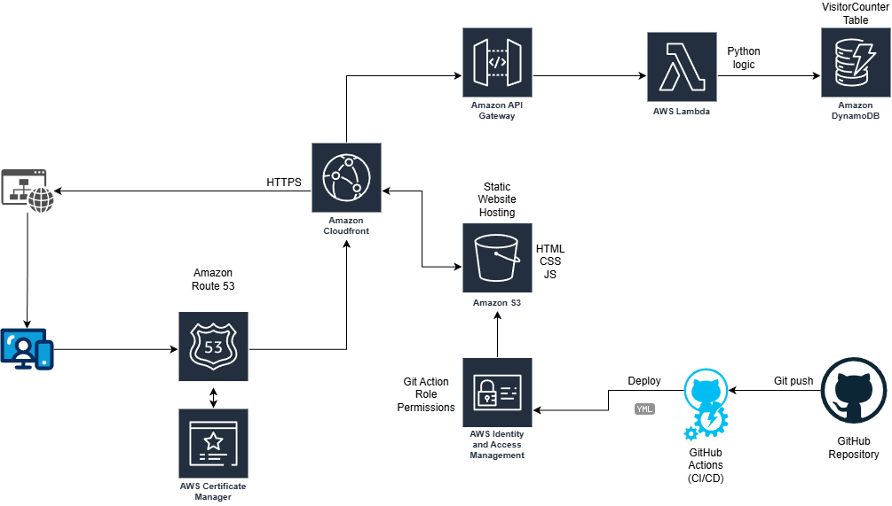
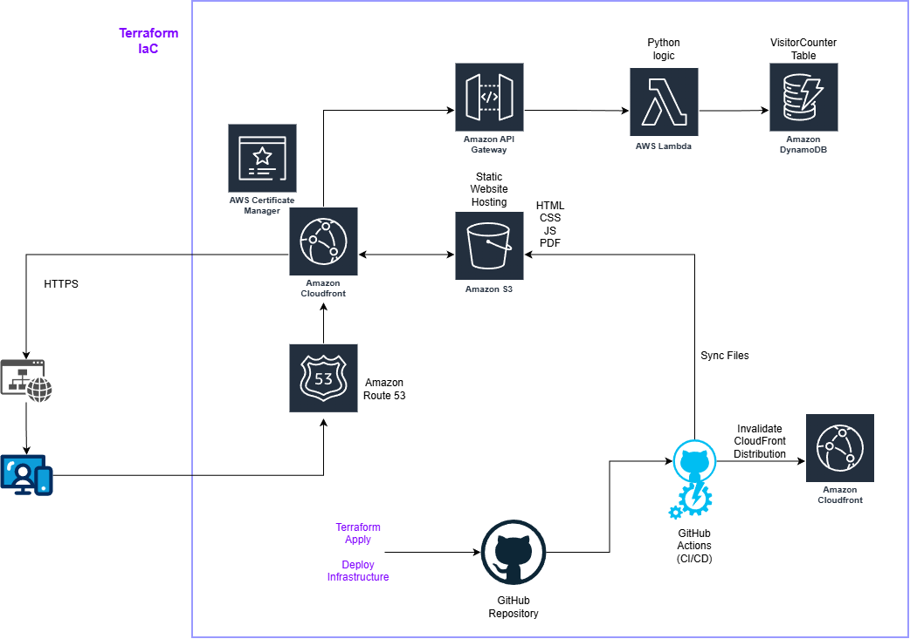

[Back Home](./index.md)
 

# AWS Cloud Resume

Date: 1/20/2026 (updated 2/15/2026)
  

## DESCRIPTION

The AWS Cloud Resume Project is a comprehensive, full-stack serverless application designed to showcase technical expertise by transforming a standard resume into an interactive document hosted by AWS. The architecture involves hosting a responsive frontend on Amazon S3, which is then globally distributed via Amazon CloudFront for low-latency delivery and secured with AWS Certificate Manager. To provide interactive functionality, the project incorporates a visitor counter powered by a backend API. This backend leverages Amazon API Gateway to trigger AWS Lambda functions that interact with an Amazon DynamoDB table, creating a cohesive, live environment that demonstrates the power of cloud-native development.

Completing this project has helped me build a robust foundation in modern cloud engineering and DevOps practices. I have learned a great deal about AWS services beyond training for certifications, by providing real-world hands-on experience with core AWS services. It has also given me a greater understanding of CI/CD pipelines through using GitHub Actions for automated testing and deployment. Beyond learning AWS specific services, this project has also helped me gain some familiarity in serverless logic, database management, and web security. By bridging the gap between theoretical certification and practical implementation, this project serves as a tangible demonstration of my ability to learn, deploy, and troubleshoot cloud solutions.
  

## AWS CLOUD RESUME PROJECT IMPLEMENTATION

### Parameters

1. Static website hosted on S3
2. Secure using HTTPS
3. Have a visitor counter
4. Include a generative AI feature
5. CI/CD pipeline using GitHub

### Step 1 - Create Resume Webpage - HTML, CSS, JS

I started with a simple HTML template and some prompt engineering to develop a style sheet and javascript to recreate my resume in html form with a style that felt pleasing and professional. At this point, the script only contained a placeholder for the AI chatbot and a visitor counter using LocalStorage.

### Step 2 - Create initial AWS Services - S3, Route 53, CloudFront

Using my previously created AWS account I made for study and exploration, I setup a new S3 bucket as a static website and uploaded the newly created webpage + assets. I tested that everything worked by pasting the S3 bucket address directly into a browser. Once confirmed, I removed all public access in preparation for using CloudFront as a more secure and faster method of accessing the webpage. I bought my domain through Route 53, requested an SSL certificate via AWS Certificate Manager (ACM), and linked it all to a CloudFront distribution. This ensured my site was not only fast but also served over a secure HTTPS connection.

### Step 3 - Create functional visitor counter - DynamoDB, Lambda / API Gateway, JS (with API trigger)

This step was my first real dive into "serverless" logic. I created an Amazon DynamoDB table to store a single value: the visitor count. To update this, I wrote a small AWS Lambda function in Python that increments the number every time it's triggered. I then set up an API Gateway to act as a front door for that Lambda function. Finally, I updated my website's JavaScript to "fetch" data from that API URL whenever the page loads, replacing my old LocalStorage placeholder with a live count from the cloud.

### Step 4 - Create GenAI Chatbot - Amazon Bedrock, Claude 3 Haiku

To give the project a modern edge, I am currently integrating a chatbot using Amazon Bedrock and the Claude 3 Haiku model. The goal is to have a "Resume Assistant" that can answer specific questions about my background. While the logic is mostly built, I am currently troubleshooting some API Gateway errors to ensure the communication between the frontend and the AI model is seamless. I have temporarily commented this feature out on the live site, but I'm looking forward to the "aha!" moment when the first response clears the gateway.

### Step 5 - Create CI/CD Pipeline using GitHub

The final piece of the puzzle was automation. I used GitHub Actions to create a CI/CD pipeline. Now, instead of manually uploading files to S3, I simply "push" my code updates to GitHub. This triggers a workflow that automatically syncs my files to the S3 bucket and clears the CloudFront cache so the changes show up immediately. This taught me how powerful automation is for maintaining a professional workflow without repetitive manual tasks.

  

## LESSONS LEARNED

* **Hands-on > Theory:** While my AWS Certified Cloud Practitioner studies gave me the vocabulary, this project gave me the "why." Seeing how S3, CloudFront, and Route 53 actually talk to each other made the concepts stick.

* **The Power of Serverless:** I learned how to build functional backends without ever having to manage a physical or virtual server. The scalability and cost-efficiency of Lambda and DynamoDB are eye-opening for a beginner.

* **Security First:** Moving from a public S3 bucket to a restricted one served through CloudFront taught me the importance of the Principle of Least Privilege and securing data in transit with HTTPS.

* **Troubleshooting is Key to Growth:** Encountering API errors and CORS issues (Cross-Origin Resource Sharing) can be frustrating, but this experience is forcing me to use CloudWatch logs and browser developer tools. Even though I have yet to overcome this challenge, I feel as though I am gaining very valuable experience and skills necessary for my growth as a cloud professional.
  

## Cloud Architecture Diagram

Here is a diagram I created to illustrate how the different AWS services link within this project.

# UPDATE - I incorporated IaC into my Cloud Resume using Hashicorp Terraform.

Following the work done by others, I duplicated my live site using terraform. I started by installing terraform and making sure it could reach my AWS account with a new Terraform admin role for tracking changes made from this new source. I then had to setup my main.tf with the AWS region, create a gitignore file, and initialize the project using 'terraform init'.  From there, the first resource I created was an S3 bucket with the same assets (HTML, CSS, JS) as my live S3 bucket. Just like with creating the S3 bucket initially, I made it a static website and open to public viewing to test everything was working. I quickly changed it back to block public access and then setup the CloudFront connection through the main.tf file with the necessary origin pointer and AWS ACM Certificate. I had some troubles with undeclared resource errors and the resume pdf not syncing, but those errors were quickly resolved with some Gemini and Claude queries. 

Now that the cloudfront address was working, the website was updating, and the resume pdf button was downloading my latest resume, it was time to bring down the live site and use my purchased domain with this new CloudFront Distribution. Since I already had a Route 53 record with my domain, I just needed to add the resource reference block to main.tf. I also had to add the domain aliases to my CloudFront Distribution resource block, but I came across another error, this time concerning the Route 53 record. Turns out, my code was trying to create a new record where one already exists. Rather than deleting the record, I decided to run a 'terraform import' of the Route 53 record so that terraform would take ownership of the existing record and it worked perfectly. At this point, everything except the API Gateway, Lambda function, and DynamoDB table are taken care of through IaC using terraform. I know IaC is an incredibly valuable skill to learn, so I plan to continue converting the rest of the AWS services to code as soon as I can. 

Here is the updated diagram showing the relationships between the various services.

  
[Back Home](./index.md)

